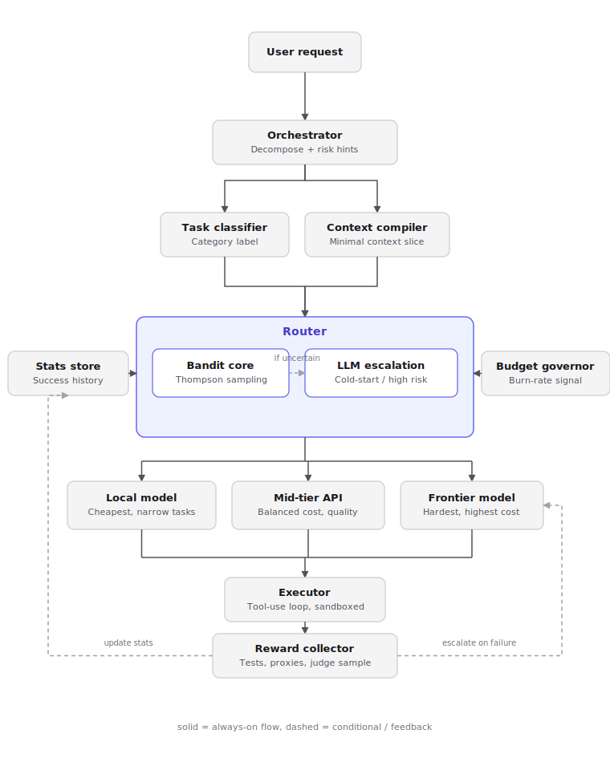

# Token-Maxxing-Harness
Agentic coding harness that min-maxes token spend with a custom model router.

## Architecture

The harness decomposes a coding task into subtasks and routes each one to a worker model chosen by
a hybrid router — a statistical bandit for the common case, with LLM judgment reserved for
cold-start or high-risk cases. See [docs/architecture.md](docs/architecture.md) for the full design.

